 👨🏻‍💻
**`Desenvolvedor Back-End`**

# Olá! Eu me chamo Victor 🌎

Tenho como foco desenvolvimento ***back-end*** e venho aprofundando meus estudos em ***Java, Maven, JPA, Hibernate***, arquitetura de aplicações entre outras tecnologias. Gosto de entender a lógica por trás dos sistemas e encontrar maneiras mais sofisticadas e eficientes de fazer as coisas funcionarem.
Além da tecnologia, gosto de ler — especialmente livros sobre psicologia, autoajuda e inovação.

-----

  
  
  
  
  
  
  
  
  
  

&ensp;

  

###
