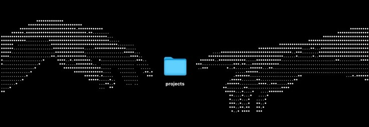

# Victor Dutra

## Sobre mim

Estudante de **Análise e Desenvolvimento de Sistemas**, com foco em desenvolvimento ***back-end***. Gosto de entender a lógica por trás dos sistemas e buscar soluções mais sofisticadas e eficientes.

- 🎯 **Foco atual:** Java, Spring, JPA/Hibernate, Maven, arquitetura de aplicações
- 💼 **Experiência prática:** Product Owner em projeto acadêmico com cliente externo real (Shopping Iguatemi) · automação de processos com Power Automate na Unimed
- 🎓 **Formação:** [ADS — UNIP](https://www.unip.br/cursos/graduacao/tecnologicos/analise_desenvolvimento_sistemas.aspx) (cursando) · [Técnico em Desenvolvimento de Sistemas — SENAC-SP](https://www.sp.senac.br/cursos-tecnicos/curso-tecnico-em-desenvolvimento-de-sistemas)
- 📚 **Fora do código:** psicologia, autoajuda e inovação

  
  
  

## Stacks

 
   

---

  

## 🚀 Projetos em Destaque

### 🔹 [Sistema de Achados e Perdidos — Shopping Iguatemi Esplanada](https://github.com/dutraxz/system-achados-perdidos-portfolio)
Sistema desktop desenvolvido para um cliente real. Matching automático de itens, central de notificações, dashboard de relatórios e comprovantes de entrega.

**Stack:** `Java` `Maven` `JPA/Hibernate` `MySQL` `MVC` `DTO`
> Líder de equipe e Product Owner — time de 5 pessoas | SENAC 2025–2026

---

### 🔹 [Sistema de Estoque — Resanf Salgados](https://github.com/dutraxz/system-estoque-resanf-salgados-portfolio)
Sistema web para micro-empresa real em Iperó/SP. CRUD completo, alertas de reabastecimento e dashboard financeiro com API RESTful.

**Stack:** `Python` `Flask` `MySQL` `SQLAlchemy` `RESTful API` `HTML/CSS`
> Líder de equipe e Product Owner — time de 5 pessoas | UNIP 2026

---
